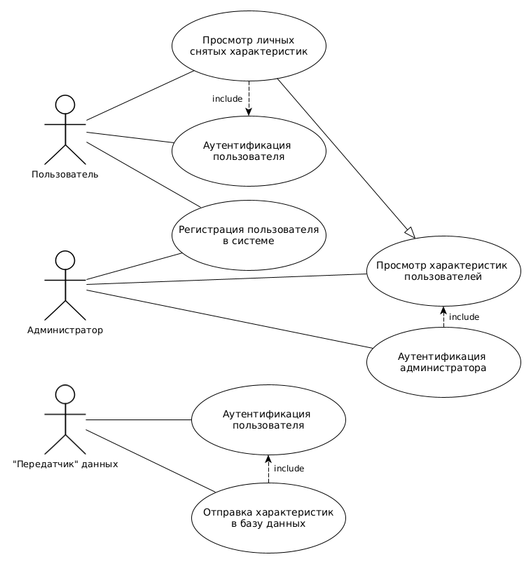

# FDSData
## Цель работы

Создание веб-приложения системы распознавания усталости пользователя автоматизированного рабочего места.

Приложение должно позволить пользователям регистрироваться в системе и просматривать данные о своих показателях. Также требуется наличие роли администратора, который будет заниматься управлением учётными записями пользователей, а также будет иметь возможность управлять собранными метриками.

## Решаемая проблема

Пользовательский интерфейс InfluxDB не позволяет автоматизировать процесс регистрации новых пользователей, а также усложняет работу с данными в временных сериях. Приложение призвано сделать работу с приложением на уровне администрирования в разы проще.

## Краткий перечень функциональных требований

1. Система аутентификации и авторизации;
2. Возможность просмотра собранных о пользователях данных;
3. Возможность управления "учётными записями" участвующих в исследовании пользователей;
4. ??? Предоставление API для работы внешних приложений и администрирования (требуется в силу немощности работы на Android + Kotlin с influxDB-kotlin-client).

## Use-Case диаграмма

## ER-диаграмма сущностей системы

